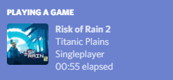
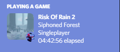

forked from Kataiser/RoR2-Rich-Presence 

# RoR2 Rich Presence
Discord Rich Presence for Risk of Rain (thrown together from [Celeste Rich Presence](https://github.com/Kataiser/celeste-rich-presence), which itself is thrown together from an older version of [TF2 Rich Presence](https://github.com/Kataiser/tf2-rich-presence))

new features

-added new stages
-shows survivor in the small image
-survivors of the void support

(The actual program is nowhere near as nice looking as this)

## Download and running
[RoR2_Rich_Presence_v3.0.zip](https://github.com/Zanzancomms/RoR2-Rich-Presence/releases/download/1.2/RoR2-Rich-Presence-3.0.zip) (python: 12 mb images: 24mb and others files, full size= 30.65 MB)
Run by running `run.bat` at the same time as the game.
